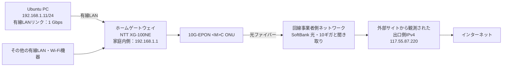

# 家庭内ネットワーク調査報告書

## 1. 調査結果

調査時点では、Ubuntu PCからホームゲートウェイおよびインターネットへの通信は正常だった。DNSによる名前解決も正常に動作していた。

主な結果は次のとおりである。

| 調査項目 | 確認結果 |
|---|---|
| PCの接続方法 | 有線LAN |
| PCの家庭内IPv4アドレス | `192.168.1.11/24` |
| 家庭内IPv4ネットワーク | `192.168.1.0/24` |
| ホームゲートウェイの家庭内側アドレス | `192.168.1.1` |
| 外部サイトから見える出口側IPv4アドレス | `117.55.87.220` |
| PC・ホームゲートウェイ間の通信 | 正常（損失0%、平均約0.435 ms） |
| インターネットへのIPv4通信 | 正常（損失0%、平均約6.431 ms） |
| DNSによる名前解決 | 正常 |
| PCと接続先機器間の有線LANリンク | 1 Gbps・全二重 |
| 契約サービス | SoftBank 光・10ギガと聞き取り（書類未確認） |

`192.168.1.11`と`192.168.1.1`は家庭内LANで使用するプライベートIPv4アドレスである。一方、`117.55.87.220`は、Webサイトへアクセスした際にインターネット側から通信元として観測されたIPv4アドレスであり、役割が異なる。

契約サービスの最大通信速度は10 Gbpsとされているが、調査対象PCの有線LANインターフェースは最大1 Gbps対応だった。そのため、このPCの有線LAN区間における理論上の上限は1 Gbpsである。

## 2. 調査の目的

自宅で使用している回線機器とUbuntu PCのネットワーク設定を確認し、次の事項を明らかにする。

- PCが家庭内ネットワークへ接続している方法
- PCおよびホームゲートウェイの家庭内IPアドレス
- 外部サイトから見える出口側のIPv4アドレス
- PCからホームゲートウェイおよびインターネットへ通信できるか
- DNSによる名前解決が動作しているか
- PCと接続先機器間の有線LANリンク速度
- 契約サービスの最大速度とPC側のリンク速度の違い

## 3. 調査対象

### 3.1 調査対象PC

| 項目 | 確認結果 | 確認方法 |
|---|---|---|
| メーカー | Lenovo | `hostnamectl`の表示および本体表示 |
| 機種 | ThinkCentre M75q-1 | `hostnamectl`の表示および本体表示 |
| OS | Ubuntu 26.04.1 LTS | `hostnamectl` |
| 接続方法 | 有線LAN | `nmcli device status` |
| インターフェース名 | `enp2s0f0` | `nmcli device status` |

### 3.2 契約回線

| 項目 | 内容 | 情報の根拠 |
|---|---|---|
| インターネットサービス | SoftBank 光 | 契約者からの聞き取り（要書類確認） |
| 契約プラン | SoftBank 光・10ギガ | 契約者からの聞き取り（要書類確認） |
| サービス上の最大通信速度 | 10 Gbps | 契約プラン名による |
| 利用エリア・回線設備 | NTT東日本のフレッツ系回線と考えられる | NTT機器の本体ラベルと`flets-east.jp`の表示 |

「10ギガ」は通信速度を表すため、単位は`10 GB`ではなく`10 Gbps`と記載する。`GB`はデータ容量、`Gbps`は1秒あたりの通信速度を表す。

10 Gbpsはサービス上の最大通信速度であり、常に10 Gbpsで通信できることを保証する値ではない。

### 3.3 回線機器

| 機器 | メーカー・型番 | 役割 | 確認方法 |
|---|---|---|---|
| ONU | NTT `10G-EPON <M>C ONU` | 光ファイバーの光信号とLANで使用する電気信号を相互に変換する | 本体ラベルを目視確認 |
| ホームゲートウェイ | NTT `XG-100NE` | 家庭内端末へのネットワーク設定の配布、外部ネットワークへの中継、ルーティングなど | 本体ラベルを目視確認 |

ONUはOptical Network Unitの略で、日本語では光回線終端装置と呼ばれる。

## 4. ネットワーク構成



この図の`192.168.1.11`と`192.168.1.1`は家庭内LANで使用するアドレスである。`117.55.87.220`は、調査時に外部Webサイトから出口として観測されたアドレスである。

接続方式によっては、`117.55.87.220`がホームゲートウェイへ直接割り当てられているとは限らない。回線事業者側の設備でアドレス変換または共有が行われている可能性があるが、今回の調査結果だけでは詳細な方式までは特定できない。

また、図中の10 Gbpsは契約サービスの最大通信速度、1 Gbpsは調査時に確認したPCと接続先機器間のリンク速度であり、同じ値を表しているわけではない。

## 5. 調査方法と確認内容

### 5.1 PCの接続方法

#### 調べたこと

PCが有線LANとWi-Fiのどちらでホームゲートウェイへ接続しているかを調べた。

#### 使用コマンド

```bash
nmcli device status
```

`nmcli`は、UbuntuでNetworkManagerの設定や状態を確認するコマンドである。`device status`は、PCにあるネットワークインターフェースの状態を表示する指定である。

#### 主な結果

```text
DEVICE    TYPE      STATE     CONNECTION
enp2s0f0  ethernet  接続済み  netplan-enp2s0f0
lo        loopback  接続済み  lo
```

`enp2s0f0`の種類が`ethernet`、状態が`接続済み`であるため、このPCは有線LANでネットワークに接続されている。

`lo`はループバックインターフェースと呼ばれ、PCが自分自身と通信するためのものである。家庭内LANとの接続には使用しない。

### 5.2 PCの家庭内IPアドレス

#### 調べたこと

有線LANインターフェースに設定されているIPアドレスを調べた。

#### 使用コマンド

```bash
ip -brief address
```

`ip`は、IPアドレスや通信経路を確認するコマンドである。`-brief`は結果を短く表示し、`address`はIPアドレス情報を表示する指定である。

#### 主な結果

```text
lo        UNKNOWN  127.0.0.1/8  ::1/128
enp2s0f0  UP       192.168.1.11/24  （IPv6アドレスは省略）
```

有線LANインターフェース`enp2s0f0`には、IPv4アドレス`192.168.1.11/24`が設定されていた。

`192.168.1.11`は家庭内LANで使用されるプライベートIPv4アドレスである。`/24`はプレフィックス長で、サブネットマスク`255.255.255.0`に相当する。このPCは`192.168.1.0/24`という家庭内ネットワークに所属している。

`UP`はインターフェースが有効であることを表す。ただし、`UP`だけではインターネットまで通信できるとは断定できないため、別途疎通を確認した。

IPv6アドレスも設定されていたが、端末や回線の識別につながる可能性があるため、本報告書では全文を省略した。

### 5.3 デフォルトゲートウェイ

#### 調べたこと

PCが家庭内ネットワークの外へ通信するとき、最初の出口として使用する機器のIPアドレスを調べた。

#### 使用コマンド

```bash
ip route
```

デフォルトゲートウェイとは、宛先への個別の経路がない場合に、データを最初に送るネットワーク上の出口である。

#### 主な結果

```text
default via 192.168.1.1 dev enp2s0f0 proto dhcp src 192.168.1.11 metric 100
192.168.1.0/24 dev enp2s0f0 proto kernel scope link src 192.168.1.11 metric 100
```

`default via 192.168.1.1`から、デフォルトゲートウェイは`192.168.1.1`である。このアドレスは、今回の構成ではホームゲートウェイXG-100NEの家庭内側に設定されている。

`dev enp2s0f0`は有線LANを使用すること、`src 192.168.1.11`はこのPCの`192.168.1.11`を送信元アドレスとして使用することを表す。

`proto dhcp`から、この経路情報がDHCPによって設定されたことが分かる。DHCPは、IPアドレス、デフォルトゲートウェイ、DNSサーバーなどの設定を端末へ自動的に配布する仕組みである。

### 5.4 PCとホームゲートウェイ間の疎通

#### 調べたこと

PCからデフォルトゲートウェイ`192.168.1.1`へ実際に通信できるかを調べた。

#### 使用コマンド

```bash
ping -c 4 -W 2 192.168.1.1
```

`ping`は確認用のデータを相手へ送り、応答が返るか調べるコマンドである。`-c 4`は4回送信、`-W 2`は各応答を最大2秒待つ指定である。

#### 主な結果

```text
4 packets transmitted, 4 received, 0% packet loss
rtt min/avg/max/mdev = 0.405/0.435/0.457/0.020 ms
```

4個の確認用データを送信し、4個すべての応答を受信した。パケット損失は0%で、平均往復時間は約0.435ミリ秒だった。

この結果から、調査時点ではPCとホームゲートウェイ間の有線LAN通信が正常だったと判断できる。4回だけの短い測定であるため、長時間にわたる回線品質まで保証する結果ではない。

### 5.5 インターネットへのIPv4疎通

#### 調べたこと

PCからホームゲートウェイを越えて、インターネット上のIPアドレスへ通信できるかを調べた。

#### 使用コマンド

```bash
ping -c 4 -W 2 1.1.1.1
```

`1.1.1.1`はCloudflareが提供するインターネット上のDNSサービスのIPアドレスである。ここではDNS機能ではなく、IPアドレスを直接指定した疎通確認の宛先として使用した。これにより、DNSによる名前解決の問題と切り分けて確認できる。

#### 主な結果

```text
4 packets transmitted, 4 received, 0% packet loss
rtt min/avg/max/mdev = 6.370/6.431/6.539/0.064 ms
```

4個すべての応答を受信し、パケット損失は0%だった。平均往復時間は約6.431ミリ秒である。

この結果から、調査時点ではPCからホームゲートウェイを経由し、IPv4でインターネット上の宛先へ通信できていたと判断できる。

ホームゲートウェイへの平均往復時間より外部への平均往復時間の方が長いが、宛先や通信経路が異なるため、両者の差を単純に「ホームゲートウェイから相手までにかかった時間」とは断定できない。

また、相手側が`ping`への応答を禁止している場合もあるため、特定の宛先から応答がないことだけでインターネット障害とは断定できない。

### 5.6 外部から見える出口側IPv4アドレス

#### 調べたこと

Webサイト「確認くん＋」へアクセスし、インターネット側から通信元として見えるIPv4アドレスを確認した。

#### 確認日時

```text
2026年9月18日 23時41分46秒
```

#### 主な結果

```text
IPアドレス：117.55.87.220
大まかな地域：埼玉
サイト自身によるISP判別：判別不可
外部サービスによるISP名：SoftBank
```

#### 結果から分かること

調査時点で、外部Webサイトから通信元として観測された出口側のIPv4アドレスは`117.55.87.220`だった。

これは、PCに設定されている家庭内LAN用の`192.168.1.11`や、ホームゲートウェイの家庭内側で使用される`192.168.1.1`とは役割が異なる。

接続方式によっては、このアドレスがホームゲートウェイへ直接割り当てられているとは限らず、回線事業者側の設備で変換または共有されている可能性がある。今回の確認だけでは、アドレスの割り当て方式や共有の有無までは特定できない。

IPアドレスは、再接続や回線事業者側の設定などによって変化することがある。このため、この結果は確認日時時点の記録として扱う。

「埼玉」という地域表示は、IPアドレス情報データベースに基づく大まかな推定であり、GPSのように自宅の正確な位置を示すものではない。また、サイト自身ではISPを判別できず、外部サービスではSoftBankと表示されたため、この表示だけを契約内容の確定資料とはしない。

### 5.7 DNSによる名前解決

#### 調べたこと

人が利用するドメイン名を、コンピューターが通信に使うIPアドレスへ変換できるかを調べた。この変換を名前解決という。

#### 使用コマンド

```bash
resolvectl query example.com
```

DNSはDomain Name Systemの略で、ドメイン名とIPアドレスの対応を調べる仕組みである。`resolvectl query`は、指定したドメイン名についてDNSへ問い合わせるコマンドである。

#### 主な結果

```text
example.com: 2606:4700:10::6814:179a  -- link: enp2s0f0
             2606:4700:10::ac42:93f3  -- link: enp2s0f0
             172.66.147.243            -- link: enp2s0f0
             104.20.23.154             -- link: enp2s0f0

-- Information acquired via protocol DNS in 9.0ms.
```

`example.com`に対応するIPv4アドレスとIPv6アドレスを取得できた。問い合わせは約9.0ミリ秒で完了したため、調査時点ではDNSによる名前解決が正常に動作していたと判断できる。

1つのドメイン名に複数のIPアドレスが登録されることがある。これは負荷分散や障害対策などのためであり、複数表示されても異常ではない。得られるアドレスは、調査時刻や接続場所によって変化する場合がある。

出力中の`Data is authenticated: no`は、この結果についてDNSSECによる認証を確認していないことを表す。`encrypted transport: no`は、暗号化DNSとして取得していないことを表す。どちらも、今回の名前解決が失敗したという意味ではない。

### 5.8 DNS設定とフレッツ系回線の確認

#### 調べたこと

PCが使用しているDNSサーバーと、ネットワークから通知された検索ドメインを調べた。

#### 使用コマンド

```bash
resolvectl status
```

#### 主な結果

```text
Link 2 (enp2s0f0)
    Current DNS Server: 192.168.1.1
           DNS Servers: 192.168.1.1  （IPv6アドレスは省略）
            DNS Domain: flets-east.jp iptvf.jp
```

`Current DNS Server: 192.168.1.1`から、このPCは家庭内のホームゲートウェイをDNSの問い合わせ先として使用していることが分かる。

また、`flets-east.jp`はNTT東日本がフレッツ 光クロスおよびフレッツ 光ネクスト向けに案内しているドメインである。NTT製のONUとホームゲートウェイを使用していることも合わせ、NTT東日本のフレッツ系回線設備を利用していると判断した。

ただし、`flets-east.jp`の表示だけで契約プロバイダーをSoftBankと特定することはできない。SoftBank 光・10ギガという情報は、ネットワークコマンドではなく契約者への聞き取りに基づいている。

### 5.9 PCと接続先機器間のLANリンク速度

#### 調べたこと

PCと接続先機器の間で成立している有線LANの速度と通信方式を調べた。

#### 使用コマンド

```bash
ethtool enp2s0f0
```

`ethtool`は、有線LANインターフェースの対応規格や現在のリンク状態を確認するコマンドである。

#### 主な結果

```text
Supported link modes: 10baseT/Half 10baseT/Full
                      100baseT/Half 100baseT/Full
                      1000baseT/Full
Speed: 1000Mb/s
Duplex: Full
Auto-negotiation: on
Port: Twisted Pair
Link detected: yes
```

`Speed: 1000Mb/s`から、調査時点のLANリンク速度は1 Gbpsである。`Duplex: Full`は送信と受信を同時に行える全二重通信、`Auto-negotiation: on`は接続機器同士が速度と通信方式を自動的に決定したことを表す。`Link detected: yes`から、LANケーブルによる物理的な接続が認識されていることも分かる。

対応モードの最大表示が`1000baseT/Full`であるため、このPCの有線LANインターフェースは最大1 Gbps対応と判断できる。

契約サービスの最大速度は10 Gbpsとされているが、このPCの有線LANインターフェースは最大1 Gbps対応である。そのため、このPCから有線LANを利用する場合、この区間の理論上の上限は1 Gbpsとなる。このように、通信経路のうち速度の低い部分が全体の上限になることをボトルネックという。

ただし、`ethtool`が表示する1 GbpsはPCと接続先機器間のリンク速度であり、インターネットの実効速度ではない。実効速度を確認するには、別途速度測定を行う必要がある。

## 6. 調査方法上の注意事項

回線機器のメーカーと型番は、本体ラベルを目視して確認した。PCの設定と通信状態は、Ubuntuのターミナルでコマンドを実行して確認した。外部から見えるIPv4アドレスは、Webサイト「確認くん＋」の表示で確認した。

契約サービスについては、契約者からの聞き取りに基づいている。契約書や請求書は今回確認していないため、正式な提出資料とする場合は書類で確認することが望ましい。

今回の調査結果は、調査時点の状態を記録したものである。IPアドレス、応答時間、DNSの回答などは、設定変更、再接続、回線事業者側の処理、調査時刻などによって変化することがある。

`ping`は4回だけの短時間測定であり、通信の長期的な安定性やインターネットの実効速度までは確認していない。

## 7. 総合判断

調査時点で、Ubuntu PCは有線LANを使用してホームゲートウェイXG-100NEへ接続されていた。PCには家庭内用のIPv4アドレス`192.168.1.11/24`が設定され、デフォルトゲートウェイは`192.168.1.1`だった。

PCからホームゲートウェイおよびインターネット上のIPv4アドレスへの`ping`はいずれも4回中4回成功し、DNSによる名前解決にも成功した。このため、調査時点の基本的な家庭内LAN接続、IPv4インターネット接続、DNS名前解決は正常だったと判断する。

外部Webサイトからは、出口側のIPv4アドレスとして`117.55.87.220`が観測された。このアドレスは家庭内で使用する`192.168.1.11`や`192.168.1.1`とは異なる種類のものであり、以前の家庭内設定調査に記録されていなかったことは異常ではない。

PCと接続先機器間の有線LANリンクは1 Gbps・全二重で成立していた。契約プランは10 Gbpsとされているが、このPCの有線LANインターフェースは最大1 Gbps対応である。このPCで10 Gbpsのリンクを利用するには、10 Gbps対応のLANインターフェース、接続先機器の対応ポート、適切なLANケーブルなどが必要になる。

## 参考資料

- NTT東日本「サービス情報サイト（NGN IPv6）接続方法」  
  <https://flets.com/flets-hikari/square/next/connect/>
- Webサイト「確認くん＋」の確認結果（2026年9月18日のスクリーンショット）
