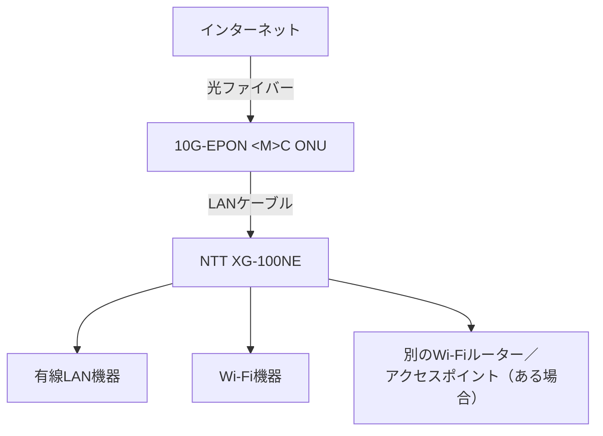

# 家庭内ネットワーク調査
## 回線機器
### ONU
* 型番：`10G-EPON <M> ONU
* 役割：光回線の信号をLANで扱える信号へ変換する
### ルーター(ホームゲートウェイ)
* メーカー：NTT
* 型番：`XG-100NE`
* 役割：家庭内端末へのIPアドレス配布、インターネット接続、ルーティングetc

## ネットワーク構成図

```mermaid
flowchart TD
    Internet["インターネット"]
    ONU["10G-EPON &lt;M&gt;C ONU"]
    Router["NTT XG-100NE"]
    Wired["有線LAN機器"]
    WiFi["Wi-Fi機器"]
    AP["別のWi-Fiルーター／<br>アクセスポイント（ある場合）"]

    Internet -->|"光ファイバー"| ONU
    ONU -->|"LANケーブル"| Router
    Router --> Wired
    Router --> WiFi
    Router --> AP
```
