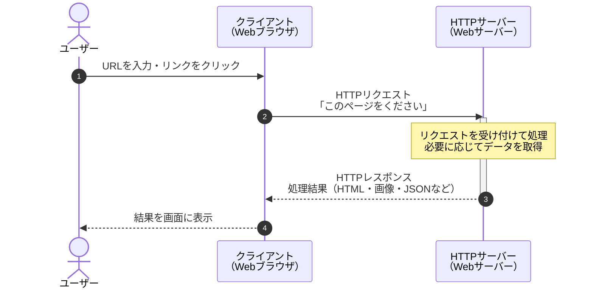
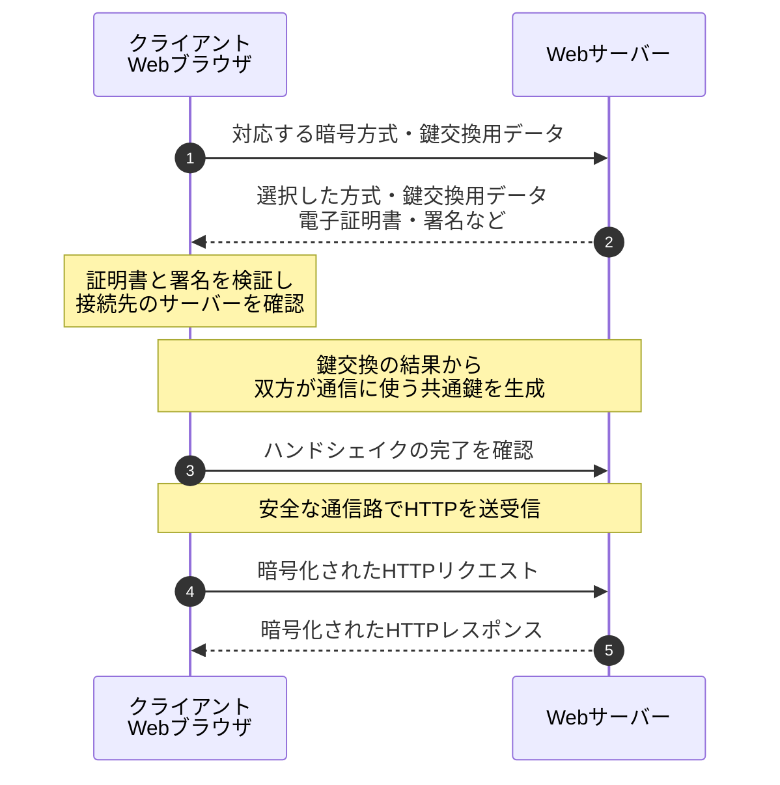
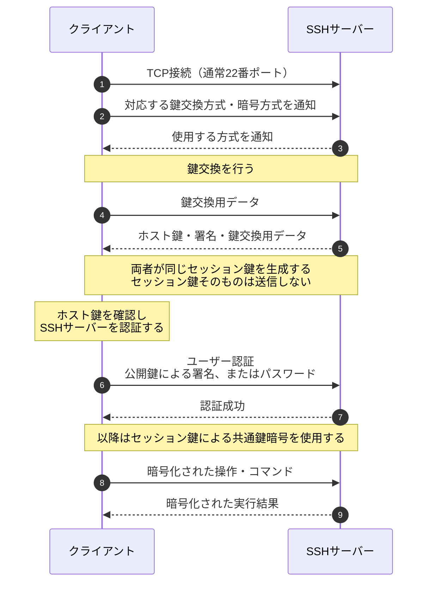

# HTTP

HTTP（Hypertext Transfer Protocol）は、HTML文書、画像、音声、動画などのリソースを送受信するための、アプリケーション層のリクエスト／レスポンス型プロトコル。

クライアントがHTTPサーバー（Webサーバー）へリクエストを送信し、サーバーがその処理結果をレスポンスとして返す。HTTPはステートレスなプロトコルであり、原則として各リクエストをほかのリクエストから独立して解釈できる。実際のWebアプリケーションでは、Cookie、セッション、トークンなどを利用してログイン状態や利用者の情報を管理している。[RFC 9110](https://www.rfc-editor.org/rfc/rfc9110.html)



HTTP/1.1とHTTP/2では、トランスポートプロトコルとして通常TCPを使用する。一方、HTTP/3では、UDPを基盤とするQUICを使用する。

ユーザーがブラウザにURLを入力すると、ブラウザは必要に応じてDNSによる名前解決を行い、サーバーとの通信経路を確立したうえでHTTPリクエストを送信する。`http`のデフォルトポート番号は80番、`https`のデフォルトポート番号は443番である。URLで別のポート番号を明示することもできる。

HTTP/1.1を平文で利用する場合、一般的にはクライアントがサーバーのTCPポート80番に接続し、そのTCP接続を使ってHTTPリクエストとHTTPレスポンスを送受信する。

> 一つの接続をすぐに切断せず、複数のリクエストとレスポンスで再利用することを持続的接続、一般にキープアライブとも呼ばれる。HTTP/1.1では持続的接続がデフォルトであり、`Connection: close`が指定された場合などに接続を終了する。[RFC 9112](https://www.rfc-editor.org/rfc/rfc9112.html)

## HTTPの主なリクエストメソッド

HTTPでは、「コマンド」ではなく「リクエストメソッド」という名称を使用する。

| メソッド | 内容 |
|---|---|
| GET | 対象リソースの現在の表現を取得する |
| HEAD | GETと同様のレスポンスヘッダを取得するが、レスポンス本文は受信しない |
| POST | 対象リソースに対し、送信した内容に基づく処理を要求する |
| PUT | 対象URIに対応するリソースの表現全体を、送信した内容で作成または置換する |
| DELETE | 対象URIとリソースとの関連付けを削除するよう要求する |
| CONNECT | プロキシなどを経由する通信トンネルを確立する |
| OPTIONS | 対象リソースまたはサーバーが対応する通信オプションを確認する |
| TRACE | リクエストが通信経路上でどのように受信されたかを確認するため、受信したリクエストを送り返させる |

OPTIONSは「オプションを設定する」メソッドではなく、利用可能な通信オプションを問い合わせるメソッドである。また、TRACEはセキュリティ上の理由から無効化されていることが多い。

## HTTPの主なステータスコード

HTTPレスポンスには、処理結果を示す3桁のステータスコードが含まれる。先頭の数字によって、次の五つのクラスに分類される。

| 分類 | 意味 |
|---|---|
| 1xx | 情報・暫定応答 |
| 2xx | 成功 |
| 3xx | リダイレクションなど、追加処理が必要な応答 |
| 4xx | クライアント側のエラー |
| 5xx | サーバー側のエラー |

ステータスコードに付随する英語表現は理由句と呼ばれるが、現在の仕様では省略や変更が可能であり、コードそのものが重要である。

### 情報・暫定応答

| コード | 理由句 |
|---|---|
| 100 | Continue |
| 101 | Switching Protocols |

### 成功

| コード | 理由句 |
|---|---|
| 200 | OK |
| 201 | Created |
| 202 | Accepted |
| 203 | Non-Authoritative Information |
| 204 | No Content |
| 205 | Reset Content |
| 206 | Partial Content |

### リダイレクションなど

| コード | 理由句 |
|---|---|
| 300 | Multiple Choices |
| 301 | Moved Permanently |
| 302 | Found |
| 303 | See Other |
| 304 | Not Modified |
| 307 | Temporary Redirect |
| 308 | Permanent Redirect |

305 Use Proxyは現在では非推奨であるため、通常使用するコードの一覧からは除外する。[RFC 9110 §15.4.6](https://www.rfc-editor.org/rfc/rfc9110.html#section-15.4.6)

### クライアント側のエラー

| コード | 理由句 |
|---|---|
| 400 | Bad Request |
| 401 | Unauthorized |
| 402 | Payment Required |
| 403 | Forbidden |
| 404 | Not Found |
| 405 | Method Not Allowed |
| 406 | Not Acceptable |
| 407 | Proxy Authentication Required |
| 408 | Request Timeout |
| 409 | Conflict |
| 410 | Gone |
| 411 | Length Required |
| 412 | Precondition Failed |
| 413 | Content Too Large |

## 補足

### TCP

TCP（Transmission Control Protocol）は、通信相手との接続を確立してからデータを送受信する、トランスポート層のプロトコル。データが失われた場合の再送や、受信したデータの順序の調整を行い、信頼性のある通信を提供する。HTTP/1.1、HTTP/2、SSHなどで利用される。[RFC 9293](https://www.rfc-editor.org/rfc/rfc9293.html)

### UDP

UDP（User Datagram Protocol）は、通信相手との接続を確立せずにデータを送受信する、トランスポート層のプロトコル。UDP自体はデータの到達や到着順序を保証せず、再送も行わないため、必要な制御は上位のプロトコルやアプリケーションで行う。[RFC 768](https://www.rfc-editor.org/rfc/rfc768.html)

### DNS

DNS（Domain Name System）は、ドメイン名に対応するIPアドレスなどの情報を問い合わせるための仕組み。例えば、ブラウザが`example.com`へアクセスするときに、接続先のIPアドレスを調べるために利用する。このように名前から対応する情報を調べる処理を名前解決と呼ぶ。[RFC 1034](https://www.rfc-editor.org/rfc/rfc1034.html)

# HTTPS

HTTPSは、TLS（Transport Layer Security）を利用して、安全にHTTPリクエストとレスポンスを送受信する仕組みである。URLは`https://`で始まり、デフォルトのポート番号は443番である。GETやPOSTなどのリクエストメソッド、ステータスコードといったHTTPの基本的な仕組みはそのまま利用する。[RFC 9110](https://www.rfc-editor.org/rfc/rfc9110.html#section-4.2.2)

TLSはSSLを引き継いだプロトコル。「SSL証明書」「SSL/TLS」という名称も使われるが、SSLは安全性の問題から使用が禁止されており、現在の説明ではTLSと呼ぶのが適切である。[RFC 7568](https://www.rfc-editor.org/rfc/rfc7568.html)

## HTTPSが提供する三つの機能

| 機能 | 役割 |
|---|---|
| 暗号化（機密性） | パスワードやページの内容などを、通信経路上の第三者に読み取られないようにする |
| 改ざん検知（完全性） | 通信途中でデータが書き換えられた場合に検知する |
| サーバー認証 | 接続先が、アクセスしようとしたドメインの正当なサーバーであることを確認する |

## 電子証明書の役割

通常のWebサイトでは、サーバーが電子証明書をブラウザへ提示する。証明書には、対象となるドメイン名、サーバーの公開鍵、有効期間などの情報が含まれる。

ブラウザは、証明書の対象がアクセス先のドメイン名と一致するか、有効期間内であるか、信頼する認証局（CA）まで証明書のつながりを検証できるかなどを確認する。さらに、TLSの処理を通じて、サーバーが証明書の公開鍵に対応する秘密鍵を持つことを確認する。これにより、通信経路上で別のサーバーになりすます攻撃を防ぐ。[RFC 9110 §4.3](https://www.rfc-editor.org/rfc/rfc9110.html#section-4.3.3)、[RFC 8446 §4.4](https://datatracker.ietf.org/doc/html/rfc8446#section-4.4)

## HTTPS通信の流れ

暗号化通信を始めるために、使用する暗号方式を決め、鍵交換やサーバー認証を行う。

次の図は、証明書を使った初回接続の流れを簡略化したもの。



TLS 1.3の通常の鍵交換では、双方が共通の秘密情報を得て、そこから通信に使う鍵を生成する。共通鍵そのものをネットワークへ送信するわけではない。

実際のHTTPデータの暗号化には、処理の速い共通鍵暗号方式を使用する。公開鍵技術は、主に鍵交換や電子署名による認証に使用する。[RFC 8446](https://datatracker.ietf.org/doc/html/rfc8446#section-2)

なお、HTTPSで確認できるのは接続先のドメインに対するサーバーの正当性であり、掲載内容や運営者の信頼性まで保証するものではない。


## 補足

### TLS

TLS（Transport Layer Security）は、通信内容の暗号化、改ざん検知、通信相手の認証を行うプロトコル。SSLの後継であり、HTTPSだけでなくメールなどの通信にも利用される。現在の利用ではTLS 1.2・1.3を前提とし、古いSSLやTLS 1.0・1.1は使用しない。[RFC 9325](https://www.rfc-editor.org/rfc/rfc9325.html#section-3.1.1)


# SSH

SSH（Secure Shell）は、ネットワークを経由して別のコンピュータへ安全にログインし、遠隔操作するためのプロトコル。通信内容を暗号化し、通信相手の認証とデータの改ざん検知も行う。

SSHは通常TCPを使用し、デフォルトのポート番号は22番である。主にリモートログイン、コマンド実行、ファイル転送、ポートフォワーディングなどに利用される。[RFC 4251](https://www.rfc-editor.org/rfc/rfc4251.html)

Telnetなどの古い方式ではパスワードや操作内容が平文で送信されるが、SSHでは通信経路が暗号化されるため、盗聴の危険を軽減できる。

## SSH接続の流れ

SSHによる接続は、概ね次の流れで行われる。



公開鍵技術は主に鍵交換、サーバー認証、公開鍵によるユーザー認証に使用する。認証後の通信データは、処理の速い共通鍵暗号方式で暗号化する。[RFC 4253](https://www.rfc-editor.org/rfc/rfc4253.html)

## SSHにおける認証

SSHでは、サーバー認証とユーザー認証を行う。

### サーバー認証

サーバー認証では、サーバーのホスト鍵を使って接続先が正しいサーバーであることを確認する。確認済みのホスト鍵は、OpenSSHでは通常`~/.ssh/known_hosts`に保存される。

初回接続時には、表示されたフィンガープリントが正しいことを確認する必要がある。ホスト鍵が以前の接続時から変化した場合は、中間者攻撃の可能性もあるため、原因を確認すべきである。

### ユーザー認証

主なユーザー認証方式は次のとおりである。[RFC 4252](https://www.rfc-editor.org/rfc/rfc4252.html)

| 認証方式 | 内容 |
|---|---|
| 公開鍵認証 | クライアントが秘密鍵を所有していることを電子署名によって証明する |
| パスワード認証 | ユーザー名とパスワードを暗号化された通信路内で送信する |
| 多要素認証 | 公開鍵とワンタイムパスワードなど、複数の要素を組み合わせる |

公開鍵認証では、公開鍵をサーバーの`~/.ssh/authorized_keys`などへ登録し、秘密鍵はクライアント側で保管する。秘密鍵そのものがサーバーへ送信されることはない。

## SSHの主な利用方法

| コマンド例 | 内容 |
|---|---|
| `ssh user@example.com` | SSHサーバーへログインする |
| `ssh -p 2222 user@example.com` | ポート番号を指定して接続する |
| `ssh user@example.com command` | サーバー上でコマンドを実行する |
| `ssh-keygen` | 公開鍵と秘密鍵のペアを作成する |
| `sftp user@example.com` | SFTPでファイルを転送する |
| `scp file user@example.com:/path/` | ファイルをサーバーへコピーする |

## ポートフォワーディング

SSHポートフォワーディングは、別のTCP通信をSSHの暗号化された通信路を通して転送する機能である。[RFC 4254](https://www.rfc-editor.org/rfc/rfc4254.html)

例えば、次のコマンドはクライアントの8080番ポートへの通信を、SSHサーバー経由で`internal.example.com`の80番ポートへ転送する。

```bash
ssh -L 8080:internal.example.com:80 user@example.com
```

SSHの初期仕様には、現在では安全性が不足しているSHA-1ベースの方式も含まれる。現在はSHA-2やCurve25519などを使用する方式が定義されており、古い方式は段階的に廃止すべきものとされている。[RFC 9142](https://www.rfc-editor.org/rfc/rfc9142.html)

## 補足

### フィンガープリント

フィンガープリントは、公開鍵などのデータからハッシュ関数で計算した、鍵を識別するための短い値。SSHの初回接続時には、表示されたサーバーのホスト鍵のフィンガープリントを、管理者などから信頼できる別の経路で入手した値と比較し、接続先を確認する。[OpenSSH：ssh-keygen](https://man.openbsd.org/ssh-keygen)

### SFTP

SFTP（SSH File Transfer Protocol）は、SSHの暗号化された通信路を利用して、ファイルのアップロードやダウンロードなどを行うプロトコル。通常はSSHと同じ22番ポートを使用する。FTPをTLSで保護するFTPSとは別の仕組みである。[OpenSSH：sftp](https://man.openbsd.org/sftp)
